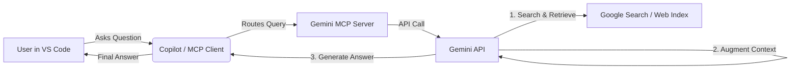

# Gemini MCP Server: Free AI Search & Grounding for VS Code

> **Open-source Perplexity alternative** for developers. Connect VS Code Copilot, Cline, or Roo to **Google Search** and **Deep Web Analysis** via the Model Context Protocol (MCP).

[](https://modelcontextprotocol.io/)
[](https://ai.google.dev/)
[](LICENSE)
[](https://python.org)
[-brightgreen?style=flat-square)](https://ai.google.dev/gemini-api/docs/pricing)

---

## 📖 Table of Contents
- [Why use this?](#why-use-this-gemini-mcp-server)
- [How it Works](#how-it-works-grounding-architecture)
- [Key Features](#key-features)
- [Available Tools](#available-tools)
- [Quick Start](#quick-start)
- [Configuration](#configuration)
- [Comparison](#how-is-this-different-from-other-mcp-search-servers)
- [Troubleshooting](#troubleshooting)

---

## Why use this Gemini MCP Server?

This is a **Model Context Protocol (MCP) server** that upgrades your AI coding assistant (like **VS Code GitHub Copilot**, Cline, or Roo Code). It provides real-time Internet access and deep web page analysis using **Google's Gemini 2.5 Flash API**.

It uses **Google Search Grounding**, allowing your LLM to fetch factual answers from the web without hallucinating.

**Benefits:**
*   **Perplexity in your IDE:** Ask "What is the latest Next.js 15 breaking change?" and get a cited answer without leaving VS Code.
*   **Free to run:** Uses the Google AI Studio free tier (**1,500 requests/day**).
*   **Deep Context:** Doesn't just read snippets; it uses Gemini's `url_context` to read full documentation pages, PDFs, and technical blogs.

### How it Works (Grounding Architecture)



---

## Key Features

- 🔍 **Grounding with Google Search:** Uses the official [Google Search Grounding](https://ai.google.dev/gemini-api/docs/google-search) for factual, up-to-date results.
- 📄 **Deep URL Analysis:** Uses Gemini's [URL Context](https://ai.google.dev/gemini-api/docs/url-context) to read large documents (HTML, PDF) for summarization and QA.
- 📚 **Citations & Sources:** Every claim is backed by a clickable link, distinguishing it from standard LLM hallucinations.
- ✅ **Standard MCP Protocol:** Compatible with any MCP client, including **Cursor**, **Windsurf**, and **VS Code**.
- ⚡ **Low Latency:** Powered by `gemini-2.5-flash`, optimized for speed and low cost.
- 🆓 **100% Free Tier:** Works with the free Google AI Studio API key (no credit card required).

---

## Available Tools

| Tool | Description | Use Case |
|---|---|---|
| `search` | **AI Web Search.** Searches Google and summarizes results using Gemini. Returns sources. | "How do I center a div in Tailwind 4?" or "Latest features in Python 3.13" |
| `analyze_url` | **Deep Page Reader.** Ingests the content of a specific URL (HTML/PDF/Text) into context. | "Read this documentation page and explain the implementation details." |

---

## Quick Start

### 1. Clone the repository

```bash
git clone https://github.com/nav9v/gemini-search-mcp.git
cd gemini-mcp-server
```

### 2. Set up the Python environment

```powershell
python -m venv .venv
# Activate virtual environment
# Windows:
.venv\Scripts\Activate.ps1
# Mac/Linux:
source .venv/bin/activate

pip install -r requirements.txt
```

<details>
<summary>💡 PowerShell execution policy error?</summary>

```powershell
Set-ExecutionPolicy -ExecutionPolicy RemoteSigned -Scope CurrentUser
```
</details>

### 3. Get your Free API Key

1.  Go to [Google AI Studio](https://aistudio.google.com/apikey).
2.  Create a **free API key** (no credit card needed).
3.  Create a `.env` file in the root directory:

```env
GEMINI_API_KEY=your_actual_api_key_here
GEMINI_MODEL=gemini-2.5-flash
```

### 4. Add to VS Code

Edit your MCP config file:
*   **Windows:** `%APPDATA%\Code\User\mcp.json`
*   **Mac/Linux:** `~/Library/Application Support/Code/User/mcp.json`

Add this entry to the `mcpServers` object (or `servers` for older configs):

```json
{
  "mcpServers": {
    "gemini-search": {
      "command": "c:/absolute/path/to/.venv/Scripts/python.exe",
      "args": ["c:/absolute/path/to/gemini_search_mcp.py"],
      "env": {
        "GEMINI_API_KEY": "your_key_here_if_not_using_env_file"
      }
    }
  }
}
```
> **Note:** Replace `/absolute/path/to/` with the full path to your cloned folder. The server loads `.env` automatically, so you don't strictly need the `env` block in JSON if `.env` is present.

### 5. Reload VS Code

Press `Ctrl+Shift+P` → **Developer: Reload Window**.

---

## 💬 Usage Examples

Open **Copilot Chat** (or your MCP client) and ask:

*   **"Search for the latest Next.js 15 breaking changes."** (Triggers `search`)
*   **"Analyze this page: https://docs.python.org/3/whatsnew/3.13.html"** (Triggers `analyze_url`)
*   **"What are the best open source alternatives to Vercel in 2026?"**
*   **"Read the docs at https://fastapi.tiangolo.com/ and explain how to use dependency injection."**

---

## Configuration

All config is via `.env` in the project root:

| Variable | Default | Description |
|---|---|---|
| `GEMINI_API_KEY` | *(required)* | Google AI Studio API key |
| `GEMINI_MODEL` | `gemini-2.5-flash` | Gemini model name |

### Supported Models

| Model | Status | Cost | Best For |
|---|---|---|---|
| `gemini-2.5-flash` | ✅ Stable | Free | **General Use** — fast, free tier, accurate. |
| `gemini-2.5-flash-lite` | ✅ Stable | Free | Ultra-fast simple queries. |
| `gemini-2.5-pro` | ✅ Stable | Paid* | Complex reasoning & research planning. |
| `gemini-2.0-flash-thinking` | 🧪 Preview | Free | Deep reasoning tasks. |

*\*Paid after free tier limits.*

---

## 💰 Pricing

**Completely Free.**
1.  **Google AI Studio API:** Free tier includes **1,500 requests per day**.
2.  **This Software:** Open source (MIT).

No credit card required. Perfect for individual developers, students, and prototypers.

---

## 🆚 Comparison

| Feature | This Server | Brave Search MCP | Tavily / Serper | Perplexity |
|---|---|---|---|---|
| **Engine** | **Google** (Grounding) | Brave Index | Tavily Index | Perplexity |
| **Full Page Read** | ✅ **Yes** (huge context) | ❌ No | ❌ No | ❌ No |
| **Citations** | ✅ Inline Links | ✅ | ✅ | ✅ |
| **Cost** | 🆓 **Free** (1.5k/day) | 🆓 Limited | 🆓 Limited | 💸 $20/mo |
| **Privacy** | 🔒 Local Client* | 🔒 Local Client | ☁️ API | ☁️ API |

*\*Runs locally, sends queries to Google Gemini API.*

---

## 🛠 Troubleshooting

<details>
<summary><strong>Verify Installation</strong></summary>

1.  Open VS Code Output panel (`Ctrl+Shift+U`).
2.  Select **"MCP Review"** or **"Github Copilot Default"** from the dropdown.
3.  Look for `gemini-search` in the logs.
</details>

<details>
<summary><strong>"GEMINI_API_KEY is not set"</strong></summary>

- Ensure `.env` is in the **same folder** as the script.
- Verify the path in `mcp.json` is absolute: `c:/Users/.../gemmini mcp/gemini_search_mcp.py`.
</details>

---

## Contributing

Pull requests are welcome! Please format code with `black` and ensure strict typing.

## License

[MIT](LICENSE) © 2026 Navneet Sharma

---

<!-- SEO Keywords -->
<details>
<summary><i>Keywords</i></summary>
VS Code Extension, Model Context Protocol, MCP Server, Gemini API, Google Search Grounding, RAG, Retrieval Augmented Generation, Perplexity Alternative, Open Source AI, Copilot Tools, Cline, Roo Code, AI Search, Python, Deep Research.
</details>
